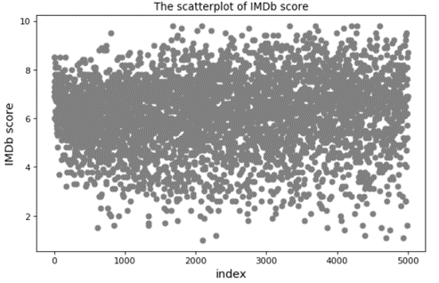
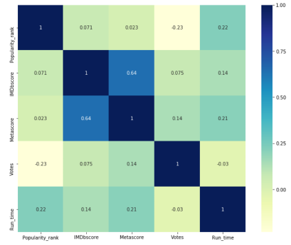
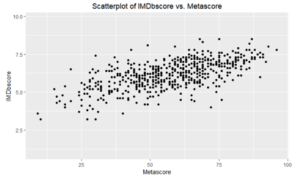
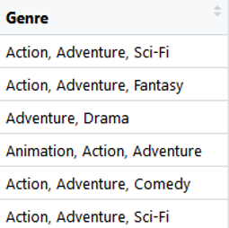
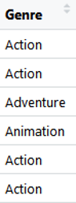
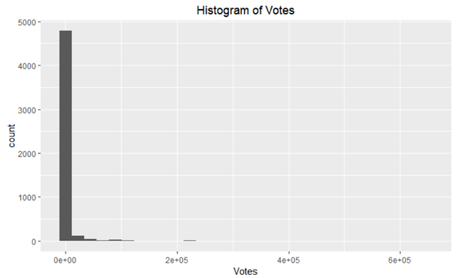
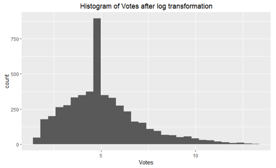
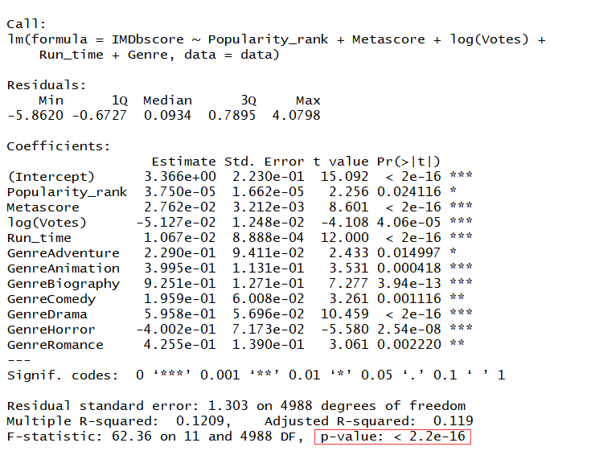
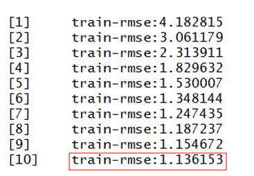

# Shiny App - Predicting Winning Rate for MLB Teams

## Table of Contents
1. [Introduction](README.md#Introduction)
2. [Deployment](README.md#Deployment)
3. [Data Cleaning and Exploratory Data Analysis](README.md#data-cleaning-and-exploratory-data-analysis)
4. [Feature Engineering](README.md#feature-engineering)
5. [Modeling](README.md#Modeling)
6. [Conclusions](README.md#Conclusions)

## Introduction
This app was developed based on the data about IMDb films released in 2018. In this project we attempt to model the films features and predict the IMDb score of a film. The data is collected by using webscrapter which is a plug-in in chrome from the website https://www.imdb.com/search/title?title_type=feature&year=2018-01-01,2018-12-31&start=1&ref_=adv_nxt. Finally, our model is deployed as an Shiny App hosted on the shinyapps.io. 

## Deployment
There are two ways to access this app.

**1. Locally, in terminal, git clone this repo to the directory of your choice:**

`$ git clone https://github.com/BadBoyfearness/Stat-418-Project-Yichen_Zhou.git`

**or download zip file to the same directory. Then change your working directory to `docker/app` and run:**

`R -e "shiny::runApp()"`

**Copy the outputting link to any browser to run this app.** 

 

**2. Simply access this Shiny app at https://zhouyichen961104.shinyapps.io/418-project/** 

 

After opening this app, I give two ways to input the data. You can choose one of them. In the first way, you can adjust the sliders and radio buttons to input desired values for Popularity_rank, Metascore, Votes, Run_time, Genre to get a prediction of the IMDbscore as well as selecting the Linear Regression model or the XGBoost model. In the second way, you need to input a .csv file, this .csv file must have and only have these five variables including  Popularity_rank, Metascore, Votes, Run_time, Genre with the correct classes.

## Data Cleaning and Exploratory Data Analysis
Firstly, let¡¯s look at the scatter plot of the outcome variable as follows:   

We can see this plot looks very nice. Because there are not any larger outliers. And there many points in the middle part of this plot and just a few points in the two sides, which may tells us the distribution of the IMDb score is normal.

Then, I will show the heatmap of my dataset. The heatmap can show the correlations between the variables of the dataset.  

From the heatmap, we can find the correlation between the IMDbscore and the Meta score is around 0.6, which is very high, so I want to find out the relationship between them by plotting the scatter plot of them.  

From this scatter plot, we can judge that there is a positive relationship between the IMDbscore and the Meta score. With one of these two variables increasing, the other variable will increase, too.

What¡¯s more  since the original data set contains some missing values in these varibales: IMDbscore, Metascore, Votes, Run_time and Genre, so I need to deal with this missing values. As for the first four variables, I want fill the missing values by the median values of them because they are numeric variables. As for the Genre variable, I want to fill the missing value by the median value because it is a character variable.

## Feature Engineering
When I plan to deal with the Genre variables, I find there are some problems. Because there are more than one values in this variable as follows:  

Actually, I need to deal with it. Otherwise, it will be difficult for me to do analysis and model fitting. I choose to save the first value of the Genre variable and delete the other values. And then the Genre variable becomes like this as follows:  

In addition, I want to see the distribution of some variables to find out whether I need to take transformation to some variables.  

From the histogram of the votes, I find the distribution of the votes variable isn¡¯t normal because it has a long tail in the right side. In order to deal with this situation, I decide to take log transformation to this Votes variable.  

After I take log transformation to it, the vote variable become more normal.

## Modeling
Now I want tot try two models: the multiple linear regression and the XGBoost model.(What¡¯s more, the clients can select one of the two models to predict the value as they want in the shinyapp.) . I compute the rmse of the linear model is 1.303. And the summary of the linear model is as follows:  

From the summary of the linear model, we can see the p-value is less than 0.01, which shows the model truly has statistical meaning. However, the R-squared is only 0.12 which is not very satisfying. So maybe we can find a better model.

Let¡¯s see the XGBoost model, I select the nround equals to 10. And this shows the rmse for each round.  

In the last round, we can see the rmse of XGBoost model is 1.13 which is less than the rmse of the multiple linear regression. Therefore, the XGBoost should be better than the linear regression model.
 
## Conclusions
Overall, our multiple linear regression do not be very satisfying. But I find another better model ¨C the XGBoost model to fit the data. The clients can select one of the two models as they want to predict the value in the shinyapp. To further improve the model performance, we may try some other modeling approaches such as random forest, neural network, etc. Besides, there might be some multicollinearity between some of the predictors. We may also need some further explorations to avoid this problem and thus to make better predictions. 
